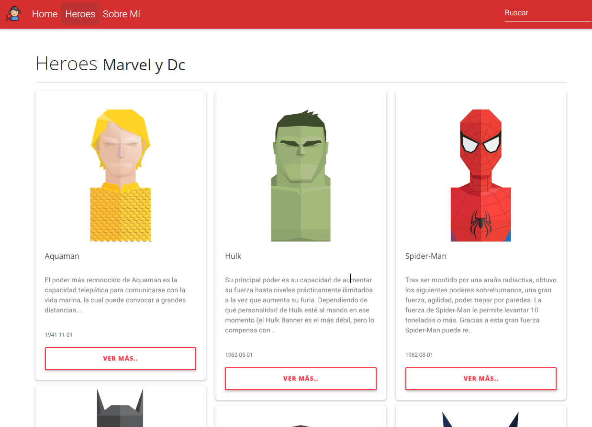

# SuperHeroApp

Web creada a modo de aprendizaje con angular.

[https://superheroapp-232823.appspot.com](https://superheroapp-232823.appspot.com)


### Imágenes





## Empezando

Para usar el proyecto en tu computadora.


### Prerrequisitos


```
NodeJS
```

### Instalación

Descargar el proyecto o clonarlo

Usar el instalador de npm para obtener modulos

```
npm install
```

Correr servidor de angular

```
ng serve -o
```


## Construido con

* [Angular](https://angular.io/docs)


## Autores

* **Pedro del Río** - *Trabajo inicial* - [pedelriomarron](https://github.com/pedelriomarron)
